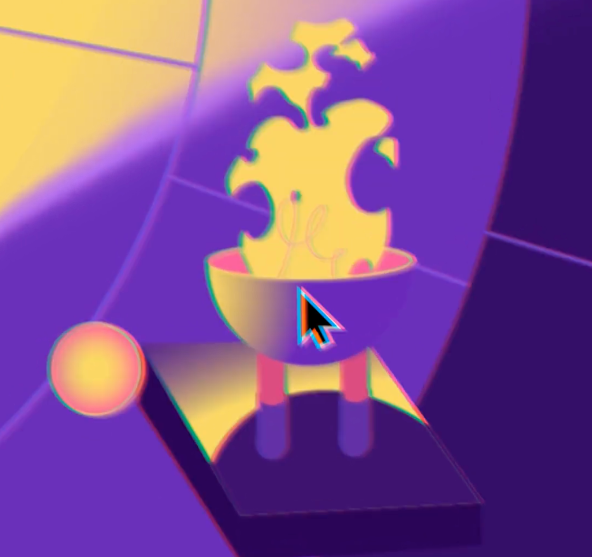
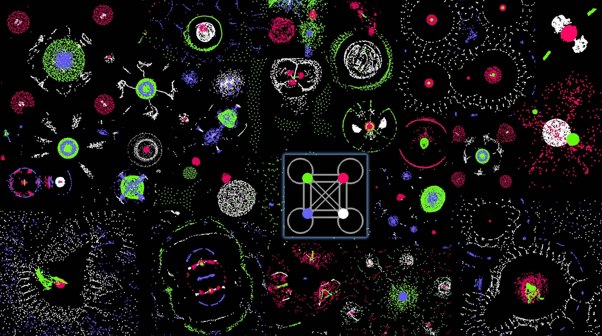

# Quiz 8

Works and code samples about the sources of my inspiration

# Imaging Technique Inspiration


##### Picture 1

##### Picture 2

Here's a link to a video of the work[Breathtaking Immersive Experience of Nature and Light](https://www.youtube.com/watch?v=Q3iIOpijMV4&list=PLe7ogHTSvv1OiXkKfC8OcmRhd-69-7y60&index=4)

## Picture 1 and 2 is a large immersive image that will present images based on people's position, some of the objects will particle dissipate away, a moody beauty that I hope can be utilized for the particle interaction feature here.



##### Picture 3

##### Picture 4

Here's a link to a video of the work[Rive - Interactive Motion Era](https://www.youtube.com/watch?v=cvNKQvyZZ0U&list=PLe7ogHTSvv1OiXkKfC8OcmRhd-69-7y60&index=5)

## Pictures 3 and 4 are images with buttons and mouse interaction behaviors performed, with strong and interesting feedback from the character objects in the images.


##### Picture 5

Here's a link to a video of the work[Digital interactive wall by design studio Büro Achter April](https://www.youtube.com/watch?v=G2ptGCwDkVE&list=PLe7ogHTSvv1OiXkKfC8OcmRhd-69-7y60&index=3)

## In picture 5 is the user's interaction with the screen, which can freely generate some shapes and then destroy some of the original arrangement structure, which can relieve stress. I would like to use the above interaction function and feedback in my project to make interesting interaction and feedback.

# Coding Technique Exploration


##### Picture 6

Here's the link to the code example[Coding Challenge 167: Ulam Spiral of Prime Numbers](https://www.youtube.com/watch?v=a35KWEjRvc0)

## Image 6 shows the code for matrix generation of dots and lines, which can be modified to irregular shapes, and colored dots of varying sizes based on this prototype.


##### Picture 7

##### Picture 8

Here's the link to the code example[Spiral](https://happycoding.io/tutorials/processing/for-loops/spiral)

## Picture 7 and Picture 8 are code renderings of colored circles that look like the shape of the 'Wheel of Fortune', which can be used to do something creative with this colored circle.


##### Picture 9

Here's the link to the code example[Create Life From a Simple Rule](https://www.youtube.com/watch?v=0Kx4Y9TVMGg)
This is a code flow that can be realized[https://github.com/hunar4321/particle-life]

## Image 9 shows the shapely form of the particles that can be used to make creative 'Wheel of Fortune' designs with this code.

### Qi Fang qfan0163


## Header 2
### Header 3
#### Header 4
##### Header 5
###### Header 6


**Bold Text** or __Bold Text__
*Italic Text* or _Italic Text_


- Item 1
- Item 2
  - Subitem 2.1
  - Subitem 2.2


1. First Item
2. Second Item
3. Third Item


I used [Google](https://www.google.com) to search for my results.


```
function helloWorld() {
console.log("Hello, world!");
}
```

> This is a blockquote.

